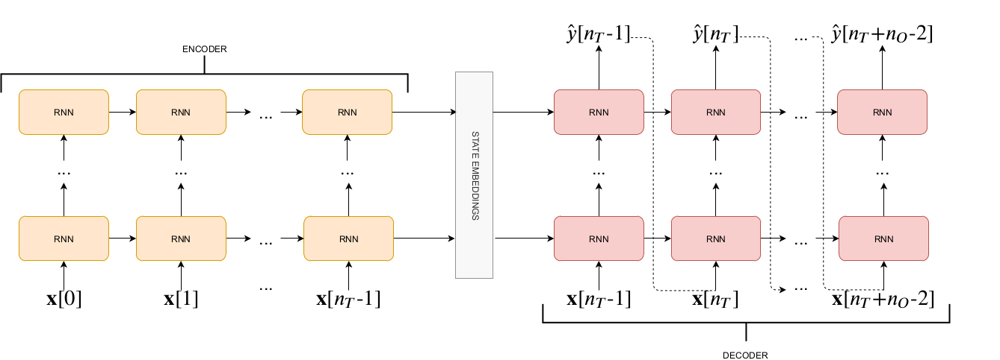

## DTS - Deep Time-Series Forecasting

A Keras library for multi-step time-series forecasting.


# What it contains
The package includes several deep learning architectures that can be used for multi step-time series forecasting. 
The package provides also several utilities to cast the forecasting problem into a supervised machine learning problem. 
Specifically a sliding window approach is used where each model is given a time window of size n<sub>T</sub> and asked 
to output a prediction for the following n<sub>O</sub> timesteps (see Figure below).

<p align="center">
  
</p>


Included architetures are:
- Feed Forward networks with and without residual connections.
- Recurrent Neural Networks (Elmann, LSTM, GRU) with different trainig procedure:
  - MIMO: a Dense Network is used to map the last state of the RNN to the output space of size n<sub>O</sub>. 
  The training and inference procedures are the same 
  - Recurrent: The RNN is trained to predict the next step, i.e. the output space during training has size 1. During inference, 
  the network is fed with (part of) the input plus it's own predictions in a recurrent fashion until an ouput vector of length 
  n<sub>O</sub> is obtained.
- Seq2Seq:
  
  
  different training procedure are available (see [Professor Forcing: A New Algorithm for Training Recurrent Networks](https://arxiv.org/abs/1610.09038) for more details)
  - Teacher Forcing: 
  
  
  - Self-Generated: 
  
  
  - TODO: [Professor Forcing](https://arxiv.org/abs/1610.09038), [Scheduled Sampling](https://arxiv.org/abs/1506.03099) 
- Temporal Convolutional Neural Networks:
    
    
  
  - [Wavenet](https://arxiv.org/abs/1609.03499)
  - [TCN](https://arxiv.org/abs/1803.01271)
  - [Conditional TCN](https://arxiv.org/abs/1703.04691)
  
The [Sacred](https://github.com/IDSIA/sacred) library is used to keep track of different experiments and allow their reproducibility. 
The installation of [MongoDB](https://www.mongodb.com/) is not mandatory but highly recommended.

# Datasets
- **Individual household electric power consumption Data Set**: Measurements of electric power consumption in _one household_ with a one-minute sampling rate over a period of almost 4 years.
[Dataset & Description](https://archive.ics.uci.edu/ml/datasets/individual+household+electric+power+consumption), 
- **GEFCom 2014**: hourly consumption data coming from ISO New England (aggregated consumption).
[Dataset & Description](http://blog.drhongtao.com/2017/03/gefcom2014-load-forecasting-data.html), [Paper](https://www.sciencedirect.com/science/article/pii/S0169207016000133?via%3Dihub)

# Reference
This is the code used for [Deep Learning for Time Series Forecasting: The Electric Load Case](https://arxiv.org/abs/1907.09207).
Mind that the code has been changed a bit, thus you may notice some differences. If you find it interesting it please consider citing us:
```
@article{gasparin2019deep,
  title={Deep Learning for Time Series Forecasting: The Electric Load Case},
  author={Gasparin, Alberto and Lukovic, Slobodan and Alippi, Cesare},
  journal={arXiv preprint arXiv:1907.09207},
  year={2019}
}
```